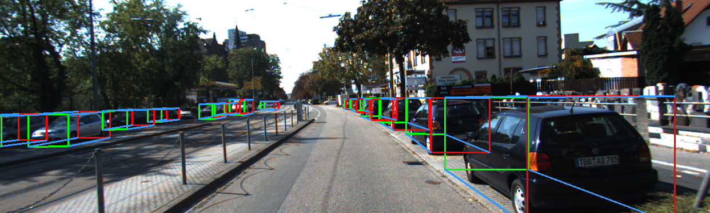

Vehicle Detection and Pose Estimation for Autonomous Driving
------------------------------------------------------------
**Libor Novak**, May 2017

This repository contains source code for my Master's thesis, which describes a deep leanining approach to 2D and 3D bounding box detectioin of cars from monocular images with an end-to-end neural network. The network was created by combining the ideas from DenseBox, SSD, and MS-CNN. It can perform multi-scale detection of 2D or 3D bounding boxes in a single pass and can run in 10fps on 0.5MPx images (images from the KITTI dataset) on a GeForce GTX Titan X GPU.

For details about the method see [PDF with the Master's thesis](http://libornovak.com/files/master_thesis.pdf).


### 2D and 3D Bounding Box Detection Video
I created a video showing the output of a trained `r_2_x2_to_x16_s2` DNN on unseen data - sequences from the KITTI dataset, which you can find on [YouTube](https://youtu.be/O9OMIL0NwYk) ([https://youtu.be/O9OMIL0NwYk](https://youtu.be/O9OMIL0NwYk)).

[](https://youtu.be/O9OMIL0NwYk)

### Network Models
The final 2D and 3D detection network architectures can be found in [caffe/models](caffe/models). There are 2 networks with the same structure:
  * `macc_0.3_r2_x2_to_x16_s2` - 2D bounding box detection network
  * `macc3d_0.3_r2_x2_to_x16_s2` - 3D bounding box detection network

## Testing
There are several executables for examination of the network testing output under [caffe/examples/ln](caffe/examples/ln). The fact that their names contain 'pyramid' is a bit misleading as now the image pyramid has only one scale and the detectors perform multiscale detection by themseslves.
  * `macc_pyramid_test` - running a 2D detector
  * `macc3d_pyramid_test` - running a 3D detector
  * `detect_pyramid` - displays response maps of a 2D or a 3D detector

### 2D
Either you can train your own model or [download trained 2D weights (60MB)]( https://www.dropbox.com/s/zt39813k90rkswo/macc_0.3_r2_x2_to_x16_s2_iter_40000.caffemodel?dl=0). The executable takes a TXT file list with the list of image paths to run the detection on, which looks like this:
```
path/to/file/0001.png
path/to/file/0002.png
...
```
To run the 2D bounding box detector use a similar command to this
```
./caffe/build/examples/ln/macc_pyramid_test macc_0.3_r2_x2_to_x16_s2_deploy.prototxt macc_0.3_r2_x2_to_x16_s2_iter_40000.caffemodel image_list_test.txt detections.bbtxt
```
It creates 2 files - detections.bbtxt and detections_nms.bbtxt, you want to browse the latter because it is after non-maxima suppression. To see the detections in the images run the provided Python script for browsing BBTXT files:
```
python ./scripts/show_bbtxt_detections.py detections_nms.bbtxt 'kitti'
```

### 3D
Running the 3D bounding box detector is very similar. First, train or [download trained 3D weights (60MB)](https://www.dropbox.com/s/ubpmfnxxjq6qaar/macc3d_0.3_r2_x2_to_x16_s2_iter_80000.caffemodel?dl=0). You will again need a TXT file list as shown above. However, on top of that the camera matrix P and the ground plane equation needs to be provided in a form of a PGP file (the PGP file is described in the thesis). Here are examples of few lines from the PGP file for the KITTI dataset:
```
image_2/005425.png 721.537700 0.000000 609.559300 44.857280 0.000000 721.537700 172.854000 0.216379 0.000000 0.000000 1.000000 0.002746 0.000000 1.000000 0.000000 -2.100000
image_2/004714.png 721.537700 0.000000 609.559300 44.857280 0.000000 721.537700 172.854000 0.216379 0.000000 0.000000 1.000000 0.002746 0.000000 1.000000 0.000000 -2.100000
image_2/002782.png 721.537700 0.000000 609.559300 44.857280 0.000000 721.537700 172.854000 0.216379 0.000000 0.000000 1.000000 0.002746 0.000000 1.000000 0.000000 -2.100000
...
```
The command to run the detector is very similar to the 2D one:
```
./caffe/build/examples/ln/macc3d_pyramid_test macc3d_0.3_r2_x2_to_x16_s2_deploy.prototxt macc3d_0.3_r2_x2_to_x16_s2_iter_80000.caffemodel image_list_test.txt detections.bb3txt test.pgp
```
Again, 2 files will be created - detections.bb3txt and detections_nms.bb3txt. To browse the latter run
```
python ./scripts/show_bb3txt_detections.py detections_nms.bb3txt 'kitti' --path_pgp=test.pgp
```
It will show you the reconstructed 3D bounding box and the top view of the scene.
